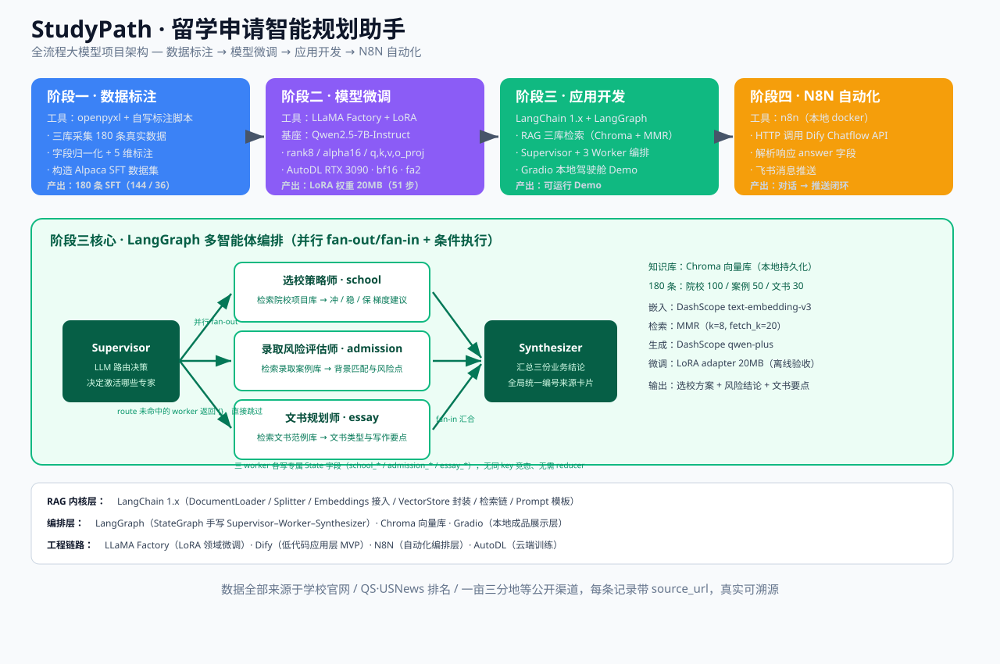

# StudyPath AI · 留学申请智能规划助手

> 基于 **LangChain + LangGraph 多智能体 + RAG 检索增强 + LoRA 领域微调** 的 AI 留学申请规划系统
> 垂直场景：选校策略 / 录取风险评估 / 文书规划

Studypath AI 把 180 条真实采集的留学数据（院校项目库 100 / 录取案例库 50 / 文书范例库 30）
变成一套**可检索、可对话、可演示、可溯源**的规划助手，并用 LoRA 让基座学会留学顾问的表达范式。



---

## 核心能力

| 模块 | 实现 |
|------|------|
| **RAG 检索增强** | LangChain 1.x LCEL 检索链 · Chroma 向量库 · MMR 检索（`k=8, fetch_k=20`）· 三库按 `source_sheet` 隔离 · 38 校中英别名归一化 |
| **多智能体编排** | LangGraph `StateGraph` 手写 Supervisor + 3 Worker + Synthesizer（选校策略师 / 录取风险评估师 / 文书规划师） |
| **LoRA 领域微调** | LLaMA Factory + Qwen2.5-7B-Instruct，rank8/alpha16，AutoDL RTX 3090 单卡，51 步 / 纯训练 106.8 秒 |
| **本地成品 Demo** | Gradio 驾驶舱（`rag/app_gradio.py`） |
| **自动化编排** | N8N（本地 docker）→ HTTP 调用 Dify Chatflow API → 飞书推送 |
| **低代码 MVP** | Dify Chatflow 已发布 |

## 技术栈

| 层 | 选型 |
|------|------|
| RAG 内核层 | LangChain 1.x（DocumentLoader / Splitter / Embeddings 接入 / VectorStore 封装 / 检索链 / Prompt 模板） |
| 编排层 | LangGraph（StateGraph） |
| 向量库 | Chroma（本地持久化） |
| 嵌入 / 生成 | DashScope `text-embedding-v3` / `qwen-plus` |
| 微调 | LLaMA Factory + PEFT（LoRA） |
| 展示层 | Gradio |
| 自动化 | N8N · Dify |
| 环境 | Python 3.12 · AutoDL（云端训练） |

## 项目结构

```
StudyPath-AI/
├── rag/                    # 应用层：RAG + 多智能体 + Gradio UI
│   ├── config.py           # 路径 / 模型名（key 从项目根 .env 读取）
│   ├── data_loader.py      # xlsx 三库 -> langchain Document（含 38 校别名映射）
│   ├── dashscope_embeddings.py  # 自实现 LangChain Embeddings 接口
│   ├── build_vectorstore.py     # 切片 + 向量化 + 持久化到 Chroma
│   ├── query_norm.py       # 查询侧学校别名归一化
│   ├── qa.py               # 检索链 + retrieve_docs / answer_from_docs
│   ├── agents.py           # LangGraph 多智能体（Supervisor + 3 Worker + Synthesizer）
│   ├── app_gradio.py       # Gradio 驾驶舱（本地成品）
│   ├── eval_retrieval.py   # 五层检索评测
│   └── demo_capture.py / build_demo_panel.py   # 真实运行取证 + 展示面板生成
│
├── finetune/               # 微调模块
│   ├── config.py / model.py / processed.py / train.py
│   ├── evaluate.py         # 指令遵循率 / 平均 ROUGE-L
│   ├── inference.py        # 推理入口（供应用层调用）
│   ├── ab_compare.py       # A/B 对照取证（基座 vs 基座+LoRA）
│   ├── fact_audit.py       # 事实层核查（来源可溯源率 / 排名一致率）
│   ├── download.py / qwen_lora_sft.yaml
│   ├── autodl_train.sh     # 云端一键：装依赖 -> 下基座 -> 训练 -> 评估
│   └── README_AUTODL.md    # 云端训练指南
│
├── annotations/            # 数据标注阶段
│   ├── build_annotations.py    # 字段归一化为标注维度
│   ├── build_sft_data.py       # xlsx 三库 -> SFT 数据集（180 条）
│   ├── figures/                # 5 张分布图
│   └── output/                 # annotated_dataset.jsonl + stats.json
│
├── data/
│   ├── raw/院校数据采集.xlsx   # 唯一数据源（三库共 180 条，每条带 source_url）
│   └── processed/              # SFT 数据集 / RAG 评测集 / A-B 对照与评估结果
│
├── dify_kb/                # Dify 知识库与部署指南
├── docs/                   # 架构图与项目说明
└── scripts/                # build_pptx.py（答辩 PPT 生成）、启动驾驶舱.ps1
```

## 快速开始

```bash
# 1. 配置密钥（项目根建 .env，已被 .gitignore 屏蔽）
echo "DASHSCOPE_API_KEY=sk-你的key" > .env

# 2. 应用层：建向量库 + 启动 Gradio 驾驶舱
cd rag
pip install -r requirements.txt
python build_vectorstore.py       # 建 Chroma 向量库（只需一次）
python app_gradio.py              # 浏览器打开 http://127.0.0.1:7860

# 3. 数据标注与 SFT 数据集生成
python -m annotations.build_annotations    # xlsx -> 标注数据 + 分布图
python -m annotations.build_sft_data       # xlsx -> train/eval.jsonl + dataset_info.json

# 4. 微调（需 24GB 显存；本地 4GB 跑不了 7B）
pip install -r finetune/requirements.txt
python -m finetune.download       # 下 Qwen2.5-7B-Instruct 到 pretrained/
bash finetune/autodl_train.sh     # 云端一键训练（见 finetune/README_AUTODL.md）

# 5. 评测与取证
python -m finetune.ab_compare     # A/B 对照
python -m finetune.evaluate       # 指令遵循率 / ROUGE-L
python -m finetune.fact_audit     # 事实层核查（本地可跑，无需 GPU）
python rag/eval_retrieval.py      # RAG 五层检索评测
```

## 实测结果

**检索层**（`data/processed/rag_metrics.json`）

| 指标 | 结果 |
|---|---|
| 对抗集（口语化提问）HitRate@8 | **100%** |
| MRR | 0.933 |
| 回答忠实度 | 100% |
| 路由覆盖率 | 100% |
| 延迟 P50 | 2.67s（RAG）/ 3.12s（多智能体） |

**微调层**

| 指标 | 结果 |
|---|---|
| train_loss → eval_loss | 1.2952 → **0.7597**（收敛未过拟合） |
| 训练步数 / 纯训练耗时 | 51 步 / **106.83 秒**（RTX 3090 单卡） |
| 权重体积 | LoRA adapter 约 **20MB** |
| 指令遵循率 / 平均 ROUGE-L | **100.0%** / 0.5731 |
| A/B 对照 | 3/3 组业务任务输出发生行为改变 |

## 数据来源与真实性

所有数据来自公开可查渠道，**每条记录带 `source_url`**：

- 学校官网 Admission 页（项目要求、截止日、学费）
- QS / USNews / CSRankings（排名）
- 一亩三分地 / 寄托天下 / ChaseDream / 新东方前途（录取案例）

RAG 知识库与微调数据集**共用同一份 xlsx 底座**，零虚构、零样本数据混入。

## 能力边界（如实说明）

微调模块经过量化核查，结论是**表达层生效、事实层不承担**：

| 层面 | 实测 |
|---|---|
| 表达层 | ✅ 3/3 组任务输出从泛化陈述句转为第一人称文书语体 + 结构化输出 |
| 事实层 | ⚠️ 生成文本的来源 URL 对知识库真实 URL 白名单溯源命中率 **0/20**，排名数字一致率 **0/7** |

**因此本项目采用「RAG 检索层负责事实与 source_url 溯源 + 微调层负责语体与结构生成」的双轨架构**，
而非纯微调方案。核查脚本 `finetune/fact_audit.py` 可在本地复现（无需 GPU）。

另：本地开发机为 GTX 1650 4GB，无法加载 7B 基座（约 14GB），
因此应用主链路调用云端 API，微调以「离线权重 + A/B 对照 + 双轨评估」方式独立验收。

## 后续可继续打磨

1. **微调接线**：`finetune/inference.py::generate_essay()` 入口已就绪，可在 24GB 显存环境把生成侧切到本地 LoRA
2. **评测集扩量**：检索评测 30 道、微调自动评估 20 条 → 扩到 50–60 道并补误判归因
3. **数据扩容**：按 xlsx 模板持续采集，观测 LoRA 效果随数据量的变化
4. **Gradio 增强**：历史对话、导出 PDF 咨询报告、院校对比雷达图

## 许可

本项目为毕业设计作品，仅用于学习与研究。

---

> **作者**：paomo1 · **方向**：AI 大模型应用开发
